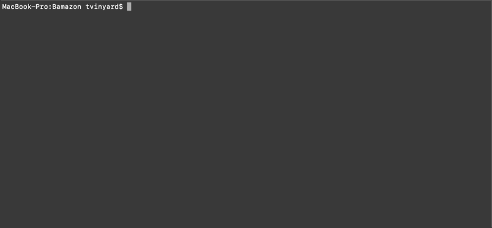

# Bamazon

## Description
Bamazon is a command-line application built with Node.js and MySQL that allows a user to construct a MySQL database and then edit said database with three distinct javascript files. `bamazonCustomer.js` allows the user to view the products table and then make a 'purchase' from that table. `bamazonManager.js` allows the user view products for sale, view low inventory, add inventory, and add new items. `bamazonSupervisor.js` produces a view on the fly of cost metrics by joining the products and departments tables.

## Instructions
1. Initialize Bamazon by cloning this repository
2. Run `npm -v` and `node -v` to verify installation of npm and node.js
3. In created directory, run npm install in order to install necessary node packages
4. Create tables in MySQL database (can use MySQL Workbench) from the .sql files in this repo
5. Now you are ready to take full advantage of Bamazon. From the terminal, you can access/view/edit the database as follows.
6. Bamazon Customer functionality: `node bamazonCustomer.js`

7. Bamazon Manager functionality: `node bamazonManager.js`

8. Bamazon Supervisor functionality: `node bamazonSupervisor.js`

Everything is written and maintained by me (tpvinyard). Thanks for visiting!
